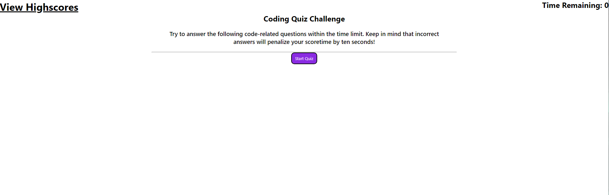
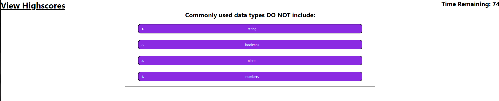
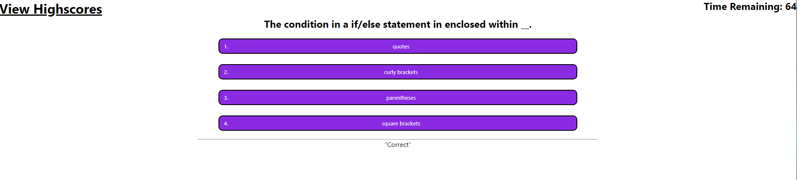
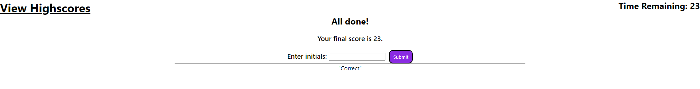

# Khievs-Coding-Quiz

This is a quiz about coding.

## Description

Khiev's Coding Quiz: [Link](https://chrissnakhiev.github.io/Khievs-Coding-Quiz/)

Khievs-Coding-Quiz github: [Link](https://github.com/ChrissnaKhiev/Khievs-Coding-Quiz)

This website is a quiz about coding. It will deduct time based on incorrect answers to the quiz. The remaining time will be your final score at the end of the quiz. You can log your score via local storage. With the local storage data you are able to view highscores and compare with yourself or peers.  

## Installation

N/A

## Usage

User will be able to generate a password in which they can use for their profiles for different applications.

## Credits

N/A

## License

Please refer to the LICENSE in the repo.